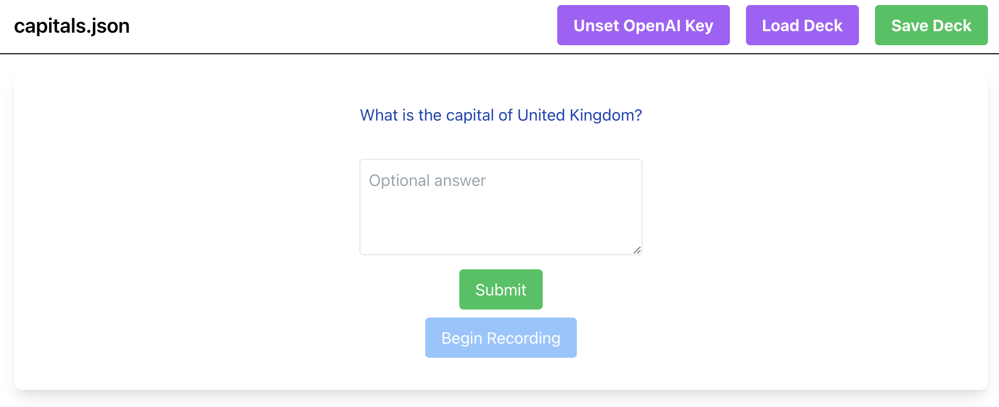

# AI Flash Cards

This is a simple React flash card app that optionally uses OpenAI APIs to narrate, transcribe audio, and grade cards. I wanted a simple flash card app, and this was a fun exercise after a long break from web development.

It has the following basic features:
* Displays flash cards using the SM2 spaced repetition algorithm.
* Accepts decks in CSV or JSON format.
* Stores decks in browser local storage.
* Can export a deck with the spaced repetition metadata so it can be resumed later.

If the OpenAI key is set, it includes the additional features:
* Text-to-speech for the card front whenever the card changes.
* Can input either voice or text to answer the card.
* Assigns a grade for the answer using the SM2 grades, rather than having the user grade their own recall.

The OpenAI API key needs to be set on the client side. All API calls are made directly to OpenAI from the browser.

You can try the app on the GitHub page for the project:
https://andrewgph.github.io/ai-flash-cards

## Screenshot

## How to Run the App

### `npm start`

This command runs the app in the development mode. Open [http://localhost:3000](http://localhost:3000) to view it in your browser.

The page will reload when you make changes.\
You may also see any lint errors in the console.